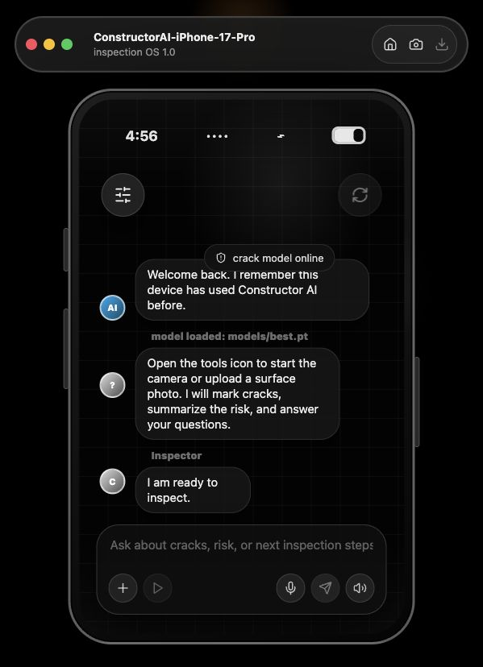
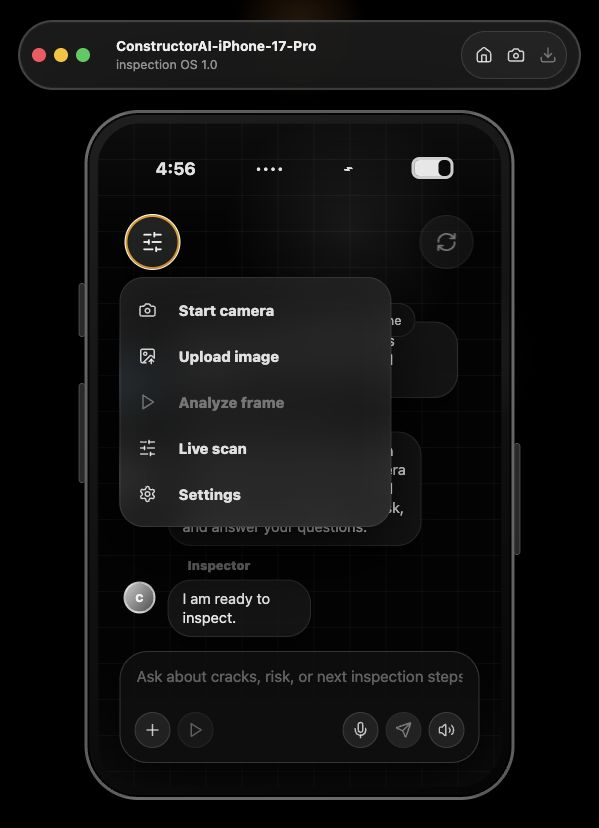

# Construction for Newbies

**Construction for Newbies** is an AI inspection assistant that uses a YOLO crack-detection model to analyze camera frames or uploaded surface photos, then explains what it sees through a clean chat interface with voice input, speech output, and English/Spanish support.

Developer: **Joshue Torres**

## Live Demo

- Frontend: https://josuetorresf2.github.io/construction-for-newbies/
- Backend API: deploy with the Render blueprint in this repo, then set the GitHub repository variable `VITE_API_BASE` to the deployed API URL.

The GitHub Pages frontend is public and installable as a PWA. Full AI detection requires a deployed backend because YOLO inference runs server-side.

## Product Highlights

- Real-time inspection workflow for construction surfaces.
- YOLO-powered crack detection using a pretrained crack segmentation model.
- Camera capture, image upload, live scan mode, and detection overlays.
- Voice input and spoken answers through browser speech APIs.
- English and Spanish UI/assistant responses.
- Returning-user memory through browser local storage.
- Installable Progressive Web App experience.
- Production deployment files for GitHub Pages and Docker-based API hosting.

## Screenshots

Default inspection chat:



Inspection tools tray:



## Tech Stack

| Layer | Technology |
| --- | --- |
| Frontend | React, TypeScript, Vite, PWA manifest/service worker |
| UI | Custom responsive dark mobile simulator interface, lucide-react icons |
| Backend | FastAPI, Uvicorn, Pydantic |
| Computer Vision | Ultralytics YOLO, OpenCV, NumPy |
| Model | Pretrained YOLO crack segmentation checkpoint from OpenSistemas |
| Data | Ultralytics Crack Segmentation dataset |
| Deployment | GitHub Pages for frontend, Docker/Render blueprint for API |

## Architecture

```text
Browser PWA
  camera / image upload / voice
        |
        v
React + TypeScript frontend
        |
        v
FastAPI backend /api/analyze-frame
        |
        v
Ultralytics YOLO crack model
        |
        v
Detections, risk summary, assistant response
```

## Repository Structure

```text
backend/                  FastAPI API and YOLO inference code
frontend/                 React/Vite/PWA client
scripts/                  dataset, model training, and model download scripts
datasets/                 YOLO dataset configs
docs/screenshots/         README screenshots
.github/workflows/        CI and GitHub Pages deployment
render.yaml               Render backend deployment blueprint
```

## How to Use the App

1. Open the app.
2. Confirm the chat says `crack model online`.
3. Tap the floating sliders icon to open inspection tools.
4. Use `Start camera` for live inspection or `Upload image` for a photo.
5. Press `Analyze frame` to run YOLO on the current camera frame.
6. Enable `Live scan` for repeated camera analysis.
7. Ask follow-up questions in the chat, by text or microphone.
8. Use the speaker button to hear the assistant response.
9. Open `Settings` to switch between English and Spanish.

Example questions:

- `Do you see cracks?`
- `Is there a structural defect?`
- `What should I inspect next?`
- `Ves grietas?`
- `Que debo inspeccionar ahora?`

## Local Development

### 1. Backend

```bash
cd construction-for-newbies
python3 -m venv .venv
source .venv/bin/activate
pip install -r backend/requirements.txt
python scripts/download_pretrained_model.py
uvicorn backend.app.main:app --reload --port 8000
```

Check the backend:

```bash
curl http://127.0.0.1:8000/api/health
```

Expected:

```json
{"ok":true,"model":"models/best.pt","defectTrained":true}
```

### 2. Frontend

```bash
cd construction-for-newbies/frontend
npm install
VITE_API_BASE=http://127.0.0.1:8000 npm run dev
```

Open the Vite URL, usually:

```text
http://127.0.0.1:5173
```

## Deployment

### Frontend: GitHub Pages

The workflow `.github/workflows/pages.yml` builds and deploys the Vite frontend to GitHub Pages on every push to `main`.

If the backend is already deployed, add a GitHub repository variable:

```text
VITE_API_BASE=https://your-api-host.example.com
```

Then rerun the Pages workflow.

### Frontend Alternative: Vercel

This repo also includes `vercel.json` for deploying the React/Vite frontend on Vercel.

Vercel setup:

1. Import this GitHub repository into Vercel.
2. Keep the project root as the repository root.
3. Add environment variable `VITE_API_BASE` with your deployed backend URL.
4. Deploy.

The included `vercel.json` runs:

```bash
cd frontend && npm ci && npm run build
```

and serves `frontend/dist`.

Use Vercel for the frontend PWA. Use Render, Fly.io, Railway, or another Docker-capable host for the FastAPI + YOLO backend.

### Backend: Render

This repo includes:

- `backend/Dockerfile`
- `render.yaml`

Deploy steps:

1. Create a Render account or open the Render dashboard.
2. Create a Blueprint from this GitHub repository.
3. Render will use `render.yaml` and the backend Dockerfile.
4. After deployment, copy the API URL.
5. Add that URL as GitHub repository variable `VITE_API_BASE`.
6. Rerun the GitHub Pages deployment.

The backend start command downloads the pretrained crack model before starting Uvicorn.

## Model and Data

Default pretrained model:

- Source: https://huggingface.co/OpenSistemas/YOLOv8-crack-seg
- License shown on Hugging Face: AGPL-3.0
- Installed locally with:

```bash
python scripts/download_pretrained_model.py
```

Training dataset:

- Ultralytics Crack Segmentation dataset
- 4,029 crack images with YOLO annotations
- Config: `datasets/crack-seg.yaml`
- More detail: `DATASETS.md`

Train your own model:

```bash
python scripts/download_crack_data.py
python scripts/train_yolo.py --data datasets/crack-seg.yaml --model yolo11n-seg.pt --epochs 100 --imgsz 640 --batch 8
mkdir -p models
cp runs/defect-detection/*/weights/best.pt models/best.pt
```

Export for edge deployment:

```bash
python scripts/export_model.py --weights models/best.pt --format onnx --imgsz 960
```

## Verification

Run backend tests:

```bash
pytest backend/tests
```

Build frontend:

```bash
cd frontend
npm run build
```

Current checks cover:

- API health route
- CORS for local Vite ports
- English/Spanish consultant responses
- Crack-risk summarization logic
- TypeScript frontend production build

## Camera and Browser Requirements

- Localhost can use camera and microphone APIs during development.
- Production deployments must use HTTPS.
- Users must grant browser camera/microphone permissions.
- If camera startup fails, the app displays a clear chat message.

## Safety Note

This app is an inspection aid, not a licensed structural engineering certification tool. Field decisions still require qualified inspection, calibrated image capture, and validation against the exact materials, environment, and defect types being inspected.
