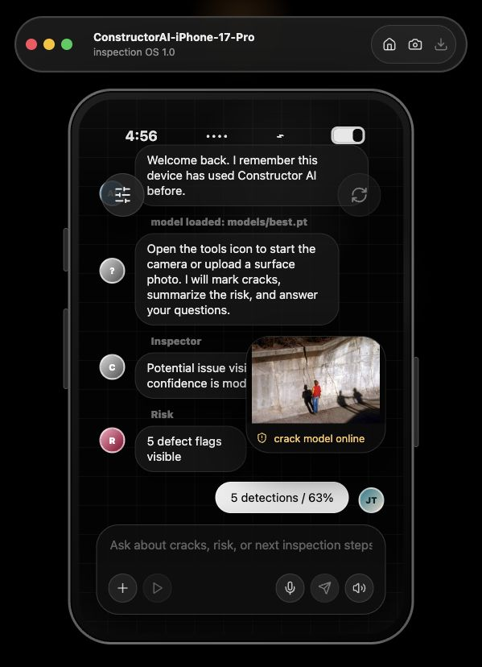
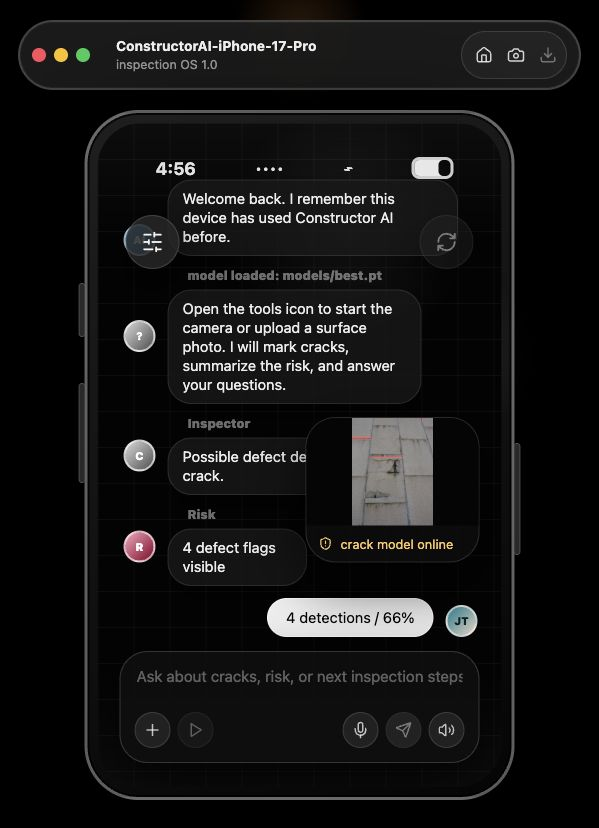

# Construction for Newbies

AI construction and manufacturing defect consultant for webcam or uploaded video frames. The app combines Ultralytics YOLO detection with browser voice recognition and speech synthesis so a user can ask what the camera sees and get a spoken inspection summary.

Developer: **Joshue Torres**

## Screenshots

Default inspection chat:


Inspection tools tray:


Built-in easy example detection:



Built-in hard example detection:



## What this repo contains

- `backend/`: FastAPI service for YOLO frame analysis and defect-consultant responses.
- `frontend/`: React/Vite app with webcam capture, live frame analysis, detection overlays, voice input, and spoken answers.
- `frontend/public/manifest.webmanifest` and `frontend/public/sw.js`: Progressive Web App install support for desktop and mobile browsers.
- `scripts/train_yolo.py`: custom YOLO training entrypoint for crack and structural-defect datasets.
- `scripts/download_crack_data.py`: downloads the real Ultralytics crack segmentation dataset.
- `scripts/download_pretrained_model.py`: downloads a pretrained crack model so the app works immediately.
- `scripts/export_model.py`: export a trained model to ONNX, OpenVINO, TensorRT, CoreML, and other Ultralytics-supported formats.
- `datasets/crack-seg.yaml`: default real crack dataset config.
- `datasets/defects.yaml.example`: YOLO dataset config template.

## Real crack dataset

This repo is wired to the real Ultralytics Crack Segmentation dataset, which contains 4,029 road and wall crack images with train/validation/test annotations. The dataset is 91.6 MB, so the repo includes a downloader and YAML config instead of committing the image archive.

```bash
python scripts/download_crack_data.py
```

Details and citation are in `DATASETS.md`.

## Bring your own broader defect dataset

For non-crack manufacturing or construction defects, place a YOLO-format detection dataset on disk and copy `datasets/defects.yaml.example` to `datasets/defects.yaml`.

Expected layout:

```text
datasets/defects/
  images/train/*.jpg
  images/val/*.jpg
  labels/train/*.txt
  labels/val/*.txt
```

Each label row uses YOLO format:

```text
class_id x_center y_center width height
```

All coordinates are normalized from 0 to 1.

## Train the defect model

```bash
cd construction-for-newbies
python3 -m venv .venv
source .venv/bin/activate
pip install -r backend/requirements.txt
python scripts/download_crack_data.py
python scripts/train_yolo.py --data datasets/crack-seg.yaml --model yolo11n-seg.pt --epochs 100 --imgsz 640 --batch 8
```

After training, copy the best weights into the default model path:

```bash
mkdir -p models
cp runs/defect-detection/*/weights/best.pt models/best.pt
```

The backend uses `models/best.pt` when present. If it is missing, it can run a generic YOLO model only for smoke testing and will label the session as not defect-trained.

For an immediately functional crack detector, install the default pretrained model:

```bash
python scripts/download_pretrained_model.py
```

## Run the app

Terminal 1:

```bash
cd construction-for-newbies
source .venv/bin/activate
python scripts/download_pretrained_model.py
uvicorn backend.app.main:app --reload --port 8000
```

Terminal 2:

```bash
cd construction-for-newbies/frontend
npm install
npm run dev
```

Open the Vite URL shown by Vite, usually `http://127.0.0.1:5173` or `http://127.0.0.1:5174`.

If the frontend is not using the default backend port, start it with:

```bash
VITE_API_BASE=http://127.0.0.1:8000 npm run dev
```

## How to use the app

1. Start the backend and frontend using the commands above.
2. Confirm the app says `crack model online`.
3. Tap the floating sliders icon to open the inspection tools tray.
4. Choose `Easy example` or `Hard example` to prove the model works without needing a camera.
5. Choose `Start camera` for webcam inspection, or `Upload image` to analyze a photo.
6. Use `Analyze frame` to run YOLO on the current camera frame.
7. Enable `Live scan` to analyze the camera feed repeatedly.
8. Type a question in the bottom message box and press the send icon.
9. Use the microphone icon to ask by voice.
10. Use the speaker icon to hear the latest answer spoken aloud.
11. Open `Settings` from the tools tray to switch between English and Spanish.

The message input starts empty. The assistant shows a hello message and short instructions inside the chat instead of pre-filling a user message. The app remembers whether the current device has used it before and remembers the selected language using browser local storage.

Example questions:

- "Do you see cracks?"
- "Is there a structural defect?"
- "What should I inspect next?"
- "Ves grietas?"
- "Que debo inspeccionar ahora?"

## App controls

- Floating sliders icon: opens and closes inspection tools.
- Refresh icon: analyzes the current camera frame when the camera is active.
- Plus icon: uploads an image from the chat composer.
- Play icon: analyzes the current frame.
- Microphone icon: starts voice input.
- Send icon: asks the AI consultant.
- Speaker icon: reads the latest answer aloud.
- Home icon: clears the current inspection state.
- Camera icon in the top bar: starts the camera.
- `Easy example`: loads an obvious crack sample and runs the same YOLO detection pipeline.
- `Hard example`: loads a more complex real-world crack sample and runs the same YOLO detection pipeline.

## Bundled example images

The app includes two web-sourced example images so users can verify the model immediately:

- Easy example: `Retaining wall failure.jpeg` from Wikimedia Commons, courtesy of G.R. Fisher, U.S. Geological Survey.
- Hard example: `Concrete wall cracking as its steel reinforcing cracks and swells 9061v.jpg` from Wikimedia Commons by JonRichfield.

Sources:

- https://commons.wikimedia.org/wiki/File:Retaining_wall_failure.jpeg
- https://commons.wikimedia.org/wiki/File:Concrete_wall_cracking_as_its_steel_reinforcing_cracks_and_swells_9061v.jpg

## Camera access

Camera access requires browser permission. Localhost works during development. Production deployments should use HTTPS, otherwise browsers may block camera and microphone APIs. If camera startup fails, the app shows a message in the chat instead of failing silently.

## Install it like an app

The frontend is a Progressive Web App. Run the backend and frontend, open the Vite URL in Chrome or Edge, then use the in-app `Install` button or the browser install icon. On iOS Safari, use Share > Add to Home Screen.

Camera and microphone access require HTTPS in production. Localhost works for development.

## Export for edge deployment

```bash
python scripts/export_model.py --weights models/best.pt --format onnx --imgsz 960
```

## Important safety note

This app is an inspection aid, not a structural engineering certification tool. Field decisions still require qualified inspection, calibrated image capture, and validation on the exact site and defect types.
